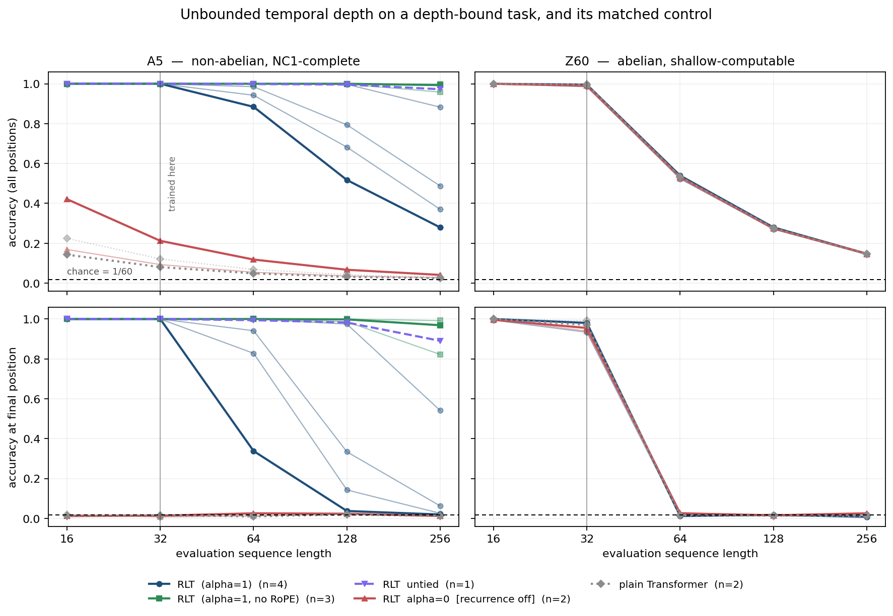

# Reproducing *Recurrent Looped Transformer*

Yifan Zhang, *Recurrent Looped Transformer*, 12 September 2026.
Reproduction on a single Colab Tesla T4 (16 GB, compute capability 7.5, 2 vCPUs).

---

## 0. What "reproducing" means for this paper

The paper reports no experiments, and is explicit about it:

> "The report develops these mechanisms; it does not report measured efficiency or
> scaling results." (§1)

> "realized reasoning quality, hardware efficiency, and scaling behavior require
> future validation." (§8)

There is therefore no headline number to hit. What the paper does contain is a
tightly specified computation, two propositions, several explicit
*non*-equivalences, and one empirical question it raises and then declines to
answer. This reproduction splits along that seam:

- **C1–C7** turn the paper's assertions into numerical tests. These need no
  training: either they hold to floating-point noise or the implementation is
  wrong. They are the part that can falsify the specification itself.
- **E1–E4** run the experiment §3.3 defers, at a scale that fits one T4.

Full claim statements are in [`CLAIMS.md`](CLAIMS.md).

### Verdicts

| | Claim | Verdict |
|---|---|---|
| C1 | Invariance to the serving split (Prop. 3.1) | **CONFIRMED** |
| C2 | Causality of `H_t` (Prop. B.1) | **CONFIRMED**, bitwise |
| C3 | A parallel SWA pass is not the recurrence (§2.4) | **CONFIRMED**, and sharpened |
| C4 | Detaching only `s_t` is not a truncation (App. C) | **CONFIRMED** |
| C5 | Unbounded temporal depth (§3.3) | **CONFIRMED** structurally; the effective-depth hedge measured |
| C6 | Current-policy replay (§5.3, §5.4) | **CONFIRMED**, with one correction to how I first posed it |
| C7 | Optimised kernel is the same model (§4.2) | **CONFIRMED** |
| E1 | Temporal depth buys computational power | **CONFIRMED** (+0.85, 10× the seed spread) |
| E2 | The gain is depth, not capacity | **CONFIRMED** (matched control shows +0.0001, within noise) |
| E3 | The gain shows up as length extrapolation | **CONFIRMED**, but only once RoPE is removed |
| E4 | Tying costs nothing | **CONFIRMED in-distribution**; out-of-distribution untestable at n=1 |

---

## 1. Exactness results

Untrained model, `d_model = 64`, `L_E = L_D = 3`, `W = 4`, fp32, Tesla T4.

Every tolerance is stated against a **measured** noise floor: the same computation
run with a padded batch, which changes cuBLAS tiling and therefore reduction order.
That floor is **2.384e-07**. "Agrees" below always means "agrees to within a small
multiple of that", never a hand-picked epsilon.

| Claim | Result |
|---|---|
| **C1** invariance to the serving split | worst over all 24 split points: **5.25e-07** (2.2× the noise floor); parallel prefill vs fully incremental encoder: 4.02e-07 |
| **C2** causality of `H_t` | perturbing `x_{>t}` changes `s_{j<t}` by **exactly 0.0** (bitwise); same-input sanity check moves 6.9e-01 |
| **C3** parallel SWA ≠ recurrence | one parallel sweep is off by **7.8e-01**; K sweeps fix **exactly K** positions; at `alpha = 0` the parallel pass is exact (1.5e-07) |
| **C4** selective detach | `‖dL/ds_star‖`: full BPTT 1.294e-01, detach-`s` **3.148e-02**, detach-KV 1.006e-01, complete detach **exactly 0.0** |
| **C5** temporal depth | `‖ds_t/ds_star‖` non-zero out to t = 128; at `alpha = 0` exactly 0 at every t |
| **C7** fixed-slot kernel | max logit difference 7.15e-07 (relative 5.3e-07); gradient cosine **1.0000000000** |

### C3 is the most informative of these

The paper only says a parallel pass is "not generally equivalent". The sharper
question is *how* inequivalent, and the answer is exact:

| parallel sweeps K | positions exact | max error |
|---|---|---|
| 1 | 1 | 7.824e-01 |
| 2 | 2 | 6.266e-01 |
| 3 | 3 | 6.461e-01 |
| 4 | 4 | 5.717e-01 |
| 8 | 8 | 3.539e-01 |

A parallel pass cannot form `u_t` without `s_{t-1}`, which is the decoder's own
output, so the only way to parallelise is to guess `s` and iterate. Each Jacobi
sweep makes exactly one more position exact — never two. Recovering a length-S
sequence costs S sweeps, which is the recurrence again. That is the quantitative
content of §4.1's "No exact parallel scan for the general nonlinear decoder is
assumed", measured rather than assumed.

The control matters as much as the result: at `alpha = 0` a single parallel sweep
is exact at **all** positions. So the non-equivalence comes specifically from
Eq. (2.11)'s feedback term, not from the sliding window, the encoder memory, or an
implementation artefact.

### C5 measures the hedge, not the claim

The block count along the state path (`t · L_D`) is true by construction, so
proving it proves nothing. The quantity worth measuring is the one §3.3 puts at
risk:

> "Gates, contraction, and learned projections may suppress the practical
> contribution of long paths; structural depth alone is not a reasoning guarantee."

and App. B: *"Normalization alone does not bound products of these Jacobians."*

Measured at initialisation:

| t | decoder blocks on the state path | `‖d(r·s_t)/d s_star‖` |
|---|---|---|
| 1 | 3 | 1.782e+01 |
| 2 | 6 | 1.122e+01 |
| 4 | 12 | 6.339e+00 |
| 8 | 24 | 4.937e+00 |
| 16 | 48 | 1.743e+00 |
| 32 | 96 | 1.492e+00 |
| 64 | 192 | 1.629e+00 |
| 128 | 384 | 1.895e+00 |

The Jacobian product **falls about 10× and then stops falling**. From t = 32 to
t = 128 — a fourfold increase in path length, 96 to 384 composed decoder blocks —
sensitivity does not decay further; it drifts slightly upward. At initialisation
this architecture neither vanishes nor explodes along the temporal path. Section 4
shows the trained consequence: the state really does carry information across
hundreds of transitions.

---

## 2. Empirical results

Setup: `d_model = 256`, `L_E = L_D = 2` (so 4 blocks per token), `W = 8`, `G = 1`,
batch 384, 1200 steps, AdamW with cosine decay, fresh data every step. Trained at
length 32, evaluated at 16/32/64/128/256. Chance 1/60 = 0.0167, ceiling 1.0.



### E1 — recurrence buys real computational power

A5 accuracy at the training length (mean ± std over seeds):

| arm | seeds | params | accuracy | **final-position accuracy** |
|---|---|---|---|---|
| RLT (`alpha=1`, tied) | 4 | 2.72 M | **1.000 ± 0.000** | **1.000** |
| RLT `alpha=0` (recurrence off) | 2 | 2.72 M | 0.152 ± 0.084 | 0.011 |
| plain causal Transformer | 2 | 4.23 M | 0.101 ± 0.029 | 0.012 |

The recurrence is worth **+0.848**, about ten times the seed spread. RLT reaches a
perfect score with **36% fewer parameters** than the plain Transformer, and the
plain baseline is the *handicapped* comparison in RLT's favour: it has full causal
attention at every layer, while the RLT decoder sees only an 8-token window plus
encoder memory. It is not losing for lack of access to the input.

The final-position column is the sharper statement. Chance is 0.0167 and the
standard error at 512 samples is 0.006, so the two fixed-depth arms — 0.011 and
0.012 — are **indistinguishable from guessing** at the deepest position, at every
length tested. They are not "worse at" the A5 word problem; they solve short
prefixes and have nothing at all at depth. That is the fixed-depth signature, and
it is exactly what `alpha = 0` predicts: with 4 blocks per token and log₂32 = 5, no
parallel scan over a length-32 word fits in the available depth.

### E2 — the gain is depth, not capacity

The same table on Z60, which has identical vocabulary size, identical label
entropy, identical chance, identical sequence statistics, and differs only in being
abelian:

| arm | seeds | accuracy at L=32 | final-position accuracy |
|---|---|---|---|
| RLT (`alpha=1`, tied) | 2 | 0.990 ± 0.008 | 0.957 |
| RLT `alpha=0` | 2 | 0.990 ± 0.000 | 0.947 |
| plain causal Transformer | 2 | 0.996 ± 0.002 | 0.981 |

Recurrence effect: **+0.0001**, against a seed spread of 0.0076. Within noise;
not a result.

This is the load-bearing control. The `alpha = 0` model has ample capacity, the
optimiser works, the budget suffices — it reaches 0.99 with its deepest position at
0.947 when the target is shallow-computable. It collapses to chance on A5 for a
reason specific to the algebra of the group, not to its own size or training. The
interaction (huge on A5, zero on Z60) is what licenses the word "depth".

### E3 — the depth advantage is real; the length decay was RoPE

A5 accuracy away from the training length:

| arm | seeds | L=32* | L=64 | L=128 | L=256 |
|---|---|---|---|---|---|
| RLT, RoPE | 4 | 1.000 ± 0.000 | 0.953 ± 0.052 | 0.747 ± 0.201 | 0.505 ± 0.266 |
| **RLT, no RoPE** | 3 | 1.000 ± 0.000 | **1.000 ± 0.000** | **0.999 ± 0.001** | **0.983 ± 0.022** |
| RLT untied, RoPE | 1 | 1.000 | 0.999 | 0.996 | 0.972 |
| RLT `alpha=0` | 2 | 0.152 | 0.086 | 0.051 | 0.034 |

With RoPE, the four seeds land at 0.279, 0.883, 0.370 and 0.487 at eight times the
training length. A mean of 0.505 with a spread of 0.266 is not a measurement of
anything; it is a coin flip.

Removing the positional encoding — leaving the causal mask and the recurrent state
as the only sources of order — gives **0.983 ± 0.022 at 8× the training length**,
with the deepest position at 0.928. The spread drops by a factor of twelve.

So the recurrent state generalises to sequence lengths it never saw, essentially
perfectly and reliably. What did not generalise was RoPE, queried outside its
trained range.

Two independent pieces of evidence say the same thing. First, the failure is
positional in shape: with RoPE, early positions stay correct while late ones
collapse (at L=64, seed 0 scores 0.884 overall but 0.338 at the final position).
Second, and quantitatively, the Z60 arms — which solve their task shallowly and so
depend entirely on position — degrade as *exactly* "correct up to position 32,
chance thereafter":

| eval length | predicted `32/L + (1−32/L)·(1/60)` | observed (Z60, all three arms) |
|---|---|---|
| 64 | 0.508 | 0.531, 0.529, 0.534 |
| 128 | 0.263 | 0.275, 0.273, 0.275 |
| 256 | 0.140 | 0.145, 0.145, 0.145 |

A hard cliff at the training length, in all three Z60 arms including RLT. Which
brings out a second finding, unplanned and worth stating on its own:

> **When a shallow solution exists, RLT takes it — and inherits its length limits.**
> On Z60, RLT with recurrence available performs identically to RLT with recurrence
> off, including the identical positional cliff. §1 says "The architecture makes
> that path available; learning useful reasoning along it is a separate question."
> Measured answer: the path is walked only when the task leaves no alternative.

This is the sharpest practical finding of the reproduction, and it is about a
choice the paper leaves open. Eq. (2.12)–(2.13) specify only that query/key maps
include "any positional transformation". That unspecified choice is the difference
between 0.51 ± 0.27 and 0.98 ± 0.02 at 8× length.

### E4 — tying

In-distribution, tied and untied are indistinguishable: both 1.000 ± 0.000 at
length 32, matching §2.6's framing of untying as removing "depth-wise parameter
reuse" rather than changing the recurrence.

Out of distribution the single untied run reached 0.972 at L=256, well above every
tied-with-RoPE seed (0.279–0.883). I am **not** claiming untying helps
extrapolation. n = 1 against an arm whose seed spread is 0.266, and the untied
model has 77% more parameters (4.82 M vs 2.72 M). The honest statement is that this
comparison was not powered to answer the question.

---

## 3. Current-policy replay (C6)

The paper's central engineering claim is a statement about equality, which makes it
cheap to falsify:

> "At identical parameters and sampling conventions, trainer and sampler represent
> the same computation." (§5.3)

Rollouts: 128 episodes, 16-token A5 prompt, 2 sampled actions, temperature 1.0, no
truncation, so `mu = p_Theta` by construction.

**(a) At identical parameters.** Ratios `r_i = exp(log p_Theta − log mu)`:

| schedule | mean r | max &#124;r − 1&#124; |
|---|---|---|
| exact (App. A.4) | 1.000000 | **0.000e+00** |
| nograd prompt | 1.000000 | 0.000e+00 |
| stale sampler states | 1.000000 | 0.000e+00 |
| **boundary reset** | 0.976021 | **1.910e+00** |

Exact replay reproduces the sampler **bitwise**. The boundary-reset arm — replaying
the response from `H_0` instead of carrying `H_T` across the split, which is the
"structural mismatch caused by different prompt/response computations" (§1) RLT
exists to remove — is wrong by up to 1.91 in the ratio, with no parameter update
required at all.

**(b) After N optimizer steps.** Max deviation of each schedule's log-probabilities
from exact replay:

| updates | nograd | stale | reset |
|---|---|---|---|
| 1 | 0.000e+00 | 1.596e-02 | 1.534e+00 |
| 2 | 0.000e+00 | 3.194e-02 | 1.526e+00 |
| 5 | 0.000e+00 | 7.986e-02 | 1.505e+00 |
| 10 | 0.000e+00 | 1.592e-01 | 1.482e+00 |
| 20 | 0.000e+00 | 3.123e-01 | 1.465e+00 |

Stale state error grows **exactly linearly** — 1.596e-02 × N to three digits —
which is §5.4 made quantitative: "After an optimizer update, previously computed
encoder KV, recurrent outputs, and decoder SWA KV generally cease to be
current-policy values." The reset arm is instead roughly constant, because it is
not stale, it is simply a different computation.

**(c) Gradient paths.** The `nograd` prompt schedule reproduces exact replay's
forward values to 0.000e+00 at every N above — §5.4's "preserves the forward
probabilities if the state is recomputed at current parameters" holds exactly. Its
gradient does not:

```
||g_exact|| = 6.018e-01     ||g_nograd|| = 1.866e-01
cosine(g_exact, g_nograd) = 0.316645       norm ratio = 0.3101
parameter entries receiving NO gradient:  exact 0,  nograd 256  ( = d_model = s_star )
```

A cosine of 0.32 is not a small perturbation of the gradient; it is a substantially
different direction that happens to sit on identical forward probabilities. And the
learned initial state `s_star` of Eq. (2.3) receives no gradient whatsoever — it is
reachable only through the prompt recurrence. This is what §5.4 means by "omits
prompt-state derivatives and is a gradient approximation", and it is invisible to
any check that only compares log-probabilities.

**(d) Truncated sampling.** §5.3 warns that "Top-k or top-p behavior sampling
generally violates this condition for an untruncated softmax target." Sampling with
top-k = 5 and replaying against the raw policy gives mean `r` = 0.143 and
max |log r| = 2.07. Replay is not at fault; `mu != p_Theta`, and as the paper says,
a transformed target "requires replacing the target probabilities consistently
throughout the objective and ratios."

---

## 4. What broke

### 4.1 The evaluation gate caught its own bug first

`check_task.py` fits an oracle shortcut policy — the best possible lookup table from
the last *k* input tokens to the label — to prove the task cannot be solved
shallowly. The first version fit and scored that table on the same data, and
reported:

```
last 3 input token(s)        : 0.4038
```

which would have meant 40% of the task was reachable from a 3-token window and the
whole A5/Z60 contrast was measuring nothing. It was an artefact: 60³ = 216,000 keys
against ~508,000 samples is about two samples per key, and the argmax of two
samples reproduces the data it was fitted on. With a held-out split:

| shortcut policy | fit-on-eval (wrong) | held-out (correct) |
|---|---|---|
| last 1 input token | 0.0322 | 0.0319 |
| last 2 input tokens | 0.0477 | 0.0185 |
| last 3 input tokens | **0.4038** | **0.0168** |
| position index only | 0.0199 | 0.0165 |

Chance is 0.0167. The corrected numbers are where group theory says they must be:
the prefix product is uniform given any bounded suffix of inputs. The residual
0.0319 at k = 1 is fully accounted for — at t = 1 the prefix product *is* g₁, so one
position in 64 is free: 1/64 + 63/64 × 0.0167 = 0.0318.

A shortcut check fitted on its own evaluation data measures the estimator's
variance, not the task's structure, and it fails in the direction that makes you
abandon a perfectly good experiment.

### 4.2 The C6 test asserted something false, and the code hid it

My first version of the replay check asserted that stale-state replay must differ
from exact replay **at identical parameters**. It must not: until a weight changes,
the sampler's cached state *is* the current-policy state, and the measurement duly
returned 0.000e+00. Had the check been written as a pass/fail assertion without
printing the number, it would have read as a failed reproduction of a claim the
paper never made. §5.4 places staleness squarely after an update, and the corrected
test measures it there, where it shows up immediately and grows linearly.

The same function also crashed, in a way worth keeping:

```
RuntimeError: The size of tensor a (3902976) must match the size of tensor b (3902720)
```

It compared gradient vectors built by concatenating parameters `if p.grad is not
None`. Under the `nograd` schedule exactly one parameter gets no gradient —
`s_star`, 256 entries — so the filter silently changed the vector's length. The
convenient fix (drop the filter's mismatch, compare what overlaps) would have
deleted the finding. Substituting zeros and *reporting the count* turned a crash
into result (c) above.

### 4.3 The reproduction was 12 hours of GPU before it was 1

The reference implementation — growing KV caches, one Python call per token per
layer — ran at **1.5 s/step** at length 64. The full grid would have been about
twelve hours, which does not fit a Colab session.

The first timing measurement was also wrong in an instructive way: it divided total
wall time by training steps, but wall time included evaluation at lengths 16→256,
and the length-256 evaluation alone is 1024 sequential decode steps. It reported
1.9 s/step for a loop actually running at 1.5 s/step.

The fix came from the paper. App. B suggests, for its gradient analysis, "a
fixed-slot representation of the decoder cache, with validity masks during
warm-up". Implemented as an execution strategy rather than an analytical device,
that makes every tensor shape constant — the SWA cache is always `[B, H, W-1, Dh]`
and cross-attention always reads the full encoder memory behind a mask — so one
compiled graph serves every position instead of a fresh one per token.

That path reads tensor entries it must not use, which is exactly what §4.2 warns
about: *"a faster kernel that reads future entries changes the model."* Hence C7,
which checks it rather than trusting it: forward values agree to 7.2e-07 and the
gradient cosine is 1.0000000000.

| implementation | ms / fwd+bwd (len 32, batch 192) |
|---|---|
| reference, growing caches | 742.8 |
| fixed-slot | 703.5 (1.06×) |
| fixed-slot + `torch.compile` | 320.9 (**2.31×**) |

This is a number about *this implementation*, not about the paper. §4 makes no
measured speedup claim and neither does this repository.

### 4.4 "The GPU is idle, so run two jobs" was wrong

The decoder loop leaves the GPU at 0–5% utilisation, so two concurrent training
processes looked free. This Colab instance has **2 vCPUs**, and the loop is bound by
Python and kernel-launch overhead on the CPU, not by the GPU. Two processes plus
their Inductor compile workers produced a load average of 3.3 on 2 cores and made no
training progress for the entire time they were observed. Reverted to one worker.

A related cost from the same limit: every evaluation length is a new tensor shape
and triggered a fresh Inductor compile. Evaluation now runs the uncompiled
fixed-slot path — legitimate precisely because C7 establishes the two paths are the
same computation.

### 4.5 A zombie process stalled the queue

The follow-up runs were chained behind `while kill -0 $SWEEP_PID; do sleep 10; done`.
The sweep printed "sweep done in 3396s" and exited — and the loop kept waiting.
Its parent was the notebook kernel, which never called `wait()`, so the process
stayed a zombie, and **`kill -0` succeeds on a zombie**. Reaping it from the kernel
released the queue. Waiting on "is this PID alive" is not the same question as "has
this process finished".

---

## 5. How it was resized

| | Paper | Here | Why this still tests the claim |
|---|---|---|---|
| Depth | `L_E = L_D = 48` (§1, Fig. 2) | `L_E = L_D = 2` (sweep), 3 (checks) | C1–C7 are exact statements, independent of depth. For E1, *smaller* depth makes the test sharper: with 4 blocks/token and length 32, log₂32 = 5 > 4, so a fixed-depth model provably cannot run a parallel scan over the word. |
| Width | unspecified | `d_model = 256` | Held identical across arms; not the variable under test. |
| Objective | next-token, Eq. (5.1)/(5.2) | Eq. (2.6) readout on a supervised per-position label | The state transition Eq. (2.4)–(2.5) is untouched, and that is what E1 is about. Feeding running products back as tokens would make the task one-step trivial (`p_t = p_{t-1} · g_t`) and destroy the depth requirement being measured. |
| Data | natural language | A5 / Z60 prefix products | Exact ground truth, no label noise, chance and ceiling known in closed form, and a matched control differing in exactly one property. |
| Positional encoding | "any positional transformation" (Eq. 2.12–2.13) | RoPE **and** none, both reported | The paper leaves this open; §2 shows the choice decides E3. |
| Precision | unspecified | fp32 | T4 is compute capability 7.5, so fp16+GradScaler is the usual choice, but these models are launch-bound rather than FLOP-bound and fp16 buys nothing. fp32 also keeps the C1–C7 tolerances meaningful. |
| Hardware co-design (§4) | — | **not tested** | §4 is explicitly "implementation targets, not measured speedups". |

### The A5 / Z60 control

Both groups have exactly 60 elements, so vocabulary size, label entropy, chance
accuracy (1/60) and sequence statistics are identical by construction. They differ
in one property: Z60 is abelian and its prefix product is a running sum mod 60,
computable in constant depth; A5 is the smallest non-abelian simple group and its
word problem is NC1-complete, so no constant-depth circuit computes it.

A gain from recurrence on A5 but not on Z60 is a depth effect. A gain on both would
have been a capacity effect, and E1 as stated would have been refuted.

---

## 6. What was not tested

- **Every hardware claim in §4.** Batching across sequences, kernel fusion, memory
  residency, and checkpoint placement are untested. The paper claims no measured
  speedup for them and neither does this work. The one speed number here (§4.3)
  compares two of my own implementations.
- **Language modelling quality.** Eq. (5.1) pretraining and Eq. (5.2) SFT masking
  semantics are implemented and exercised, but no model was trained on text, so
  nothing here speaks to whether RLT is a good language model. The A5 result says
  the recurrence can carry an exact algebraic state; it does not say that helps
  with natural language, where the required state is neither exact nor small.
- **Whether RL training actually improves with exact replay.** C6 measures the
  ratios and gradients directly, which is the claim §5.3 makes. It does *not* show
  that a policy trained with stale replay ends up worse, because the reward on this
  task is not learnable within the GPU budget available. The linear error growth in
  §3(b) is a mechanism, not an outcome.
- **Scale.** Every conclusion is at `d_model = 256` and ≤ 3 layers per stack against
  the paper's illustrative 48+48. Whether the C5 Jacobian plateau survives at 48
  layers is untested, and it is the number most likely to change.
- **E4 out-of-distribution**, at n = 1 against an arm with seed spread 0.266. Not
  powered; reported as such rather than dropped.
- **`G = L_D` memory groups.** Only `G = 1` (shared memory) was run, so §2.2's
  "layer-specific memory transformations" are implemented but unexercised.
- **Multi-turn cache semantics (§6)** beyond split invariance.
- **Longer than 8× extrapolation.** The NoPE arm is still at 0.983 at L=256; where
  it eventually breaks is unknown.
